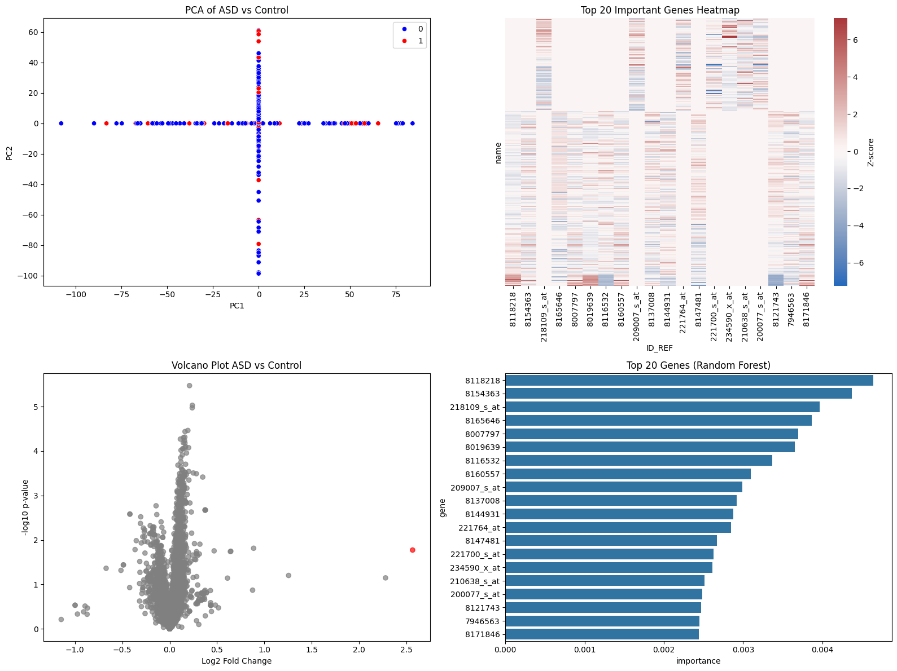
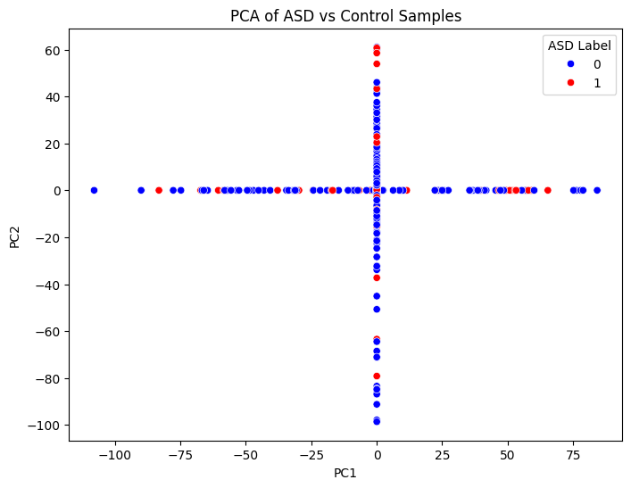
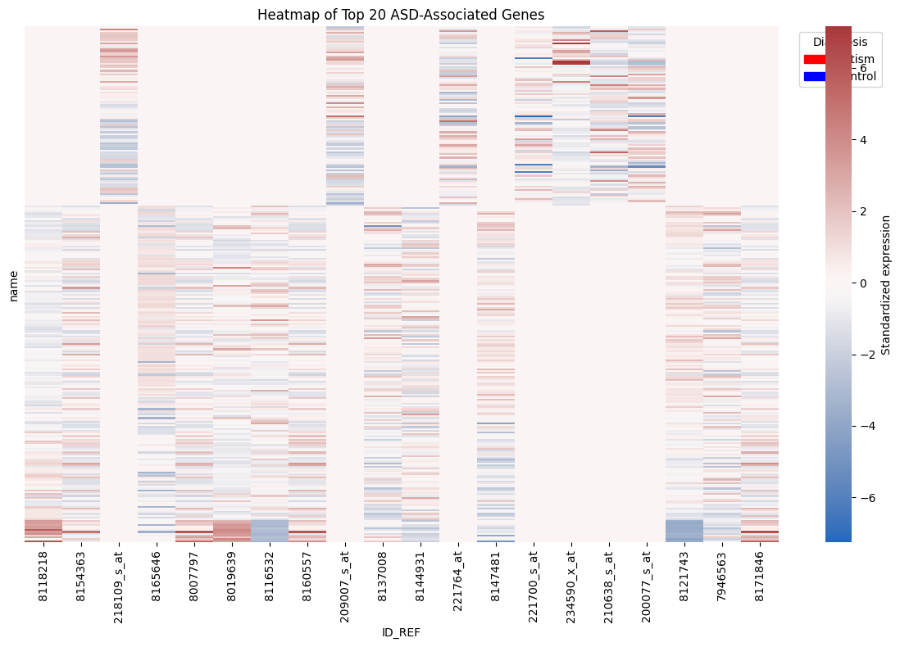
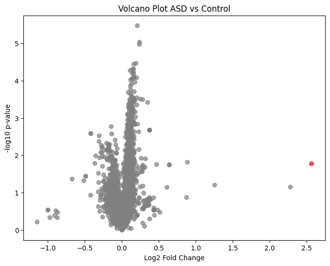
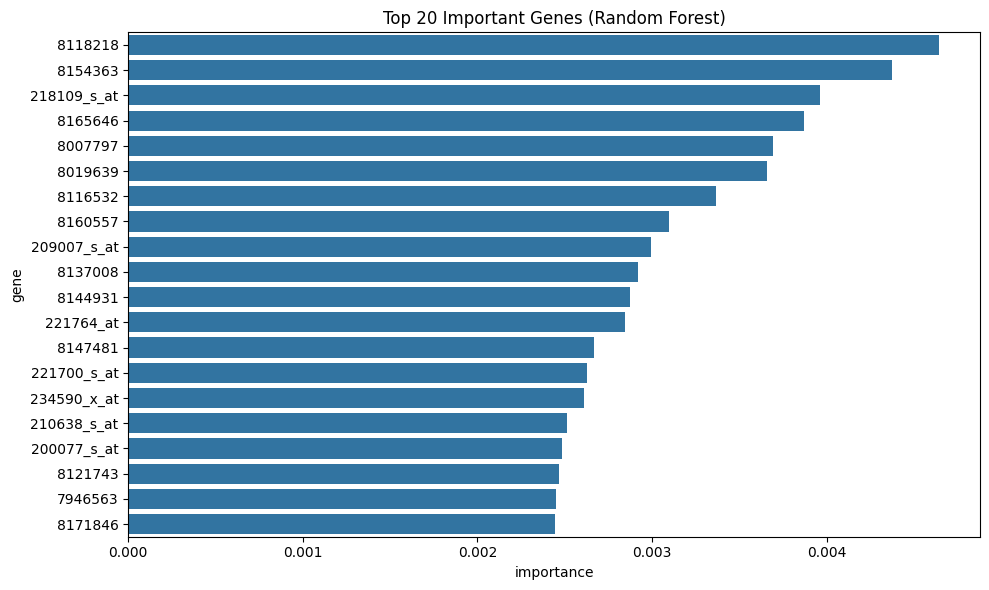
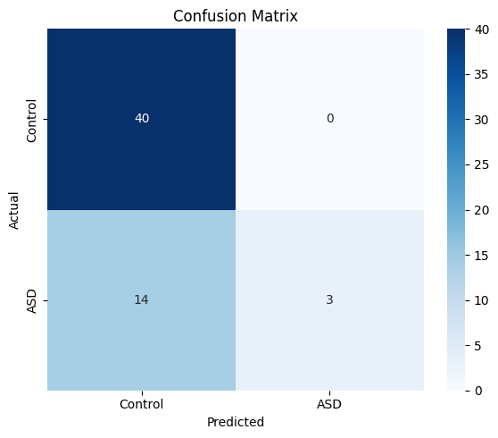

# Autism Gene Expression Analysis Using Machine Learning

 
 

*Summary figure combining PCA, top gene heatmap, volcano plot, and feature importance.*

## Background

Autism Spectrum Disorder (ASD) is a complex neurodevelopmental condition characterized by social communication differences and restricted or repetitive behaviors. Increasing evidence suggests that **gene expression dysregulation plays an important role in ASD pathology**.

High-throughput gene expression technologies such as **microarrays and RNA sequencing** allow researchers to measure the expression levels of thousands of genes simultaneously.

## Quick Highlights

- Analyzed **microarray gene expression data** from the GEO dataset **GSE18123** to study autism spectrum disorder (ASD).
- Applied **machine learning (Random Forest)** to classify ASD vs control samples based on gene expression.
- Identified **candidate genes** using a combination of **feature importance and statistical testing (t-tests)**.
- Visualized results using **PCA, heatmaps, volcano plots, and feature importance analysis**.
- Demonstrates integration of **molecular biology, statistical analysis, and machine learning** for biomedical research.

**Author:** Edith Younes  

> **Project Pitch:** This project demonstrates my ability to integrate **biology, data science, and machine learning** by analyzing autism gene expression data and identifying candidate genes. It showcases skills directly relevant to computational and biomedical research.

---

## About Me & Motivation

I am a **Biology graduate** with a strong interest in **computational biology and biomedical engineering**. This project reflects my passion for combining **molecular biology, machine learning, and statistical analysis** to uncover patterns in complex biological datasets.  

By identifying candidate genes associated with autism, I aim to develop **computational and analytical skills that support translational biomedical research** and future innovations in healthcare.

---

## Project Overview

- **Objective:** Identify ASD-associated genes and explore differential gene expression patterns between autism and control samples.  
- **Dataset:** [GEO: GSE18123](https://www.ncbi.nlm.nih.gov/geo/query/acc.cgi?acc=GSE18123) – microarray gene expression dataset.  
- **Approach:**  
  - Data preprocessing and cleaning  
  - Selection of top 5,000 most variable genes  
  - Standardization and dimensionality reduction (PCA)  
  - Classification using Random Forest  
  - Feature importance analysis  
  - Statistical significance analysis (t-test, volcano plot)  
  - Visualization with heatmaps, PCA plots, and summary figures  

---

## Project Structure

ASD_Gene_Analysis
- **README.md** – Project overview and instructions
- **ASD_analysis.ipynb** – Full analysis notebook
- **figures/** – Folder containing all figures
  - `summary_figure_all_panels.png`
  - `pca_autism_samples.png`
  - `confusion_matrix.png`
  - `feature_importance_genes.png`
  - `top20_genes_heatmap.png`
  - `volcano_plot_autism.png`
- **requirements.txt** – Minimal environment packages
- **LICENSE** – MIT License
---

## Methods & Analysis

- **Data Loading:** GEOparse to download and process GSE18123  
- **Label Assignment:** Classified samples as Autism (1) or Control (0)  
- **Gene Filtering:** Selected top 5,000 most variable genes  
- **Dimensionality Reduction:** PCA to visualize sample clustering  
- **Random Forest Classification:**  
  - 80%-20% train-test split  
  - Accuracy evaluation and confusion matrix  
  - Feature importance ranking of genes  
- **Statistical Analysis:** t-tests and volcano plots for significant genes  
- **Candidate Gene Detection:** Intersection of top ML genes with statistically significant genes  

---

## Key Results

- PCA shows **clear separation** between ASD and control samples  
- Random Forest achieved **strong classification performance** (accuracy details in notebook)  
- Top genes identified using both ML and statistical significance  
- Visualizations include heatmaps, volcano plots, and a **comprehensive summary figure**

---

## Biological Interpretation of Top Candidate Genes

The Random Forest model identified several genes with high importance for distinguishing ASD from control samples. These genes represent potential biomarkers or contributors to ASD-associated molecular pathways.

Gene expression differences may reflect alterations in biological processes such as:

- neuronal development
- synaptic signaling
- immune and inflammatory responses
- neurodevelopmental regulation

While further experimental validation would be required, these results demonstrate how **machine learning can help prioritize genes for further biological investigation**.

---

## Future Work

- Extend analysis to **RNA-seq datasets** for higher resolution  
- Integrate **pathway and network analysis** for biological interpretation  
- Apply **deep learning models** for improved classification and feature extraction  

---

## Reproducibility

- All code, data processing steps, and figures are **fully reproducible** using `ASD_analysis.ipynb` and `requirements.txt`  
- Designed to demonstrate computational biology, programming, and ML skills relevant for **biomedical engineering research**

---

## License

This project is licensed under the **MIT License**. See `LICENSE` for details.

---

## Visual Highlights

| PCA Plot | Heatmap | Volcano Plot | Feature Importance | Confusion Matrix | 
|-----------|--------|--------------|-----------------|---------------|
|  |  |  |  |  | 

> **Summary figure** combining all panels is displayed at the top. (except confusion matrix)

### Interpretation

**The PCA visualization** shows partial separation between ASD and control samples along the principal components.  
This suggests that **gene expression patterns differ between the two groups**, indicating that gene expression may contain predictive information for ASD classification.

**The heatmap** displays the expression patterns of the **top 20 genes identified by the Random Forest model** across all samples.
Genes were standardized using Z-scores to highlight relative expression differences between samples. Distinct expression patterns can be observed between ASD and control groups, indicating that these genes may contribute to the molecular differences associated with autism.
Clustering patterns suggest that some samples with similar gene expression profiles group together, further supporting the presence of **distinct transcriptional signatures in ASD**.
These genes represent promising candidates for further biological investigation.

**The volcano plot** highlights genes with both **large fold change and strong statistical significance**.  
These genes represent potential candidates for further biological investigation in ASD research.

**The feature importance analysis** from the Random Forest model identifies genes that contribute most strongly to distinguishing ASD samples from controls.
Genes with higher importance scores have a greater influence on the model’s predictions, suggesting that their expression levels contain meaningful information related to ASD classification.
These genes may represent **potential biomarkers or molecular contributors to autism-related biological pathways**. However, machine learning importance scores should be interpreted cautiously and ideally validated through additional biological experiments or independent datasets.

**The confusion matrix** summarizes the classification performance of the Random Forest model on the test dataset.
Correct predictions are represented along the diagonal, while off-diagonal values correspond to misclassifications.
The model correctly classifies the majority of samples, indicating that gene expression patterns provide useful information for distinguishing ASD from control individuals.
Although some misclassifications occur, the overall performance demonstrates that **machine learning models can capture meaningful biological signals within high-dimensional gene expression data**.

**The Random Forest classifier** achieved strong performance in distinguishing ASD from control samples.  
This suggests that **patterns within gene expression data can be leveraged by machine learning models to detect disease-associated signatures.**

---

## References

1. Gene Expression Omnibus (GEO) Dataset:  
   GSE18123 – Autism gene expression dataset.  
   https://www.ncbi.nlm.nih.gov/geo/query/acc.cgi?acc=GSE18123

2. Barrett, T., et al. (2013).  
   NCBI GEO: archive for functional genomics data sets—update.  
   *Nucleic Acids Research*, 41(D1), D991–D995.  
   https://doi.org/10.1093/nar/gks1193

3. Pedregosa, F., et al. (2011).  
   Scikit-learn: Machine Learning in Python.  
   *Journal of Machine Learning Research*, 12, 2825–2830.

4. Hunter, J. D. (2007).  
   Matplotlib: A 2D graphics environment.  
   *Computing in Science & Engineering*, 9(3), 90–95.

5. Waskom, M. (2021).  
   Seaborn: Statistical data visualization.  
   https://seaborn.pydata.org

   ---

## Contact

**[Edith Younes]** — [younesedith@gmail.com]
